# Love-Courtly

Love-Courtly allows users create an account to book reservations at tennis courts in their area and rate the tennis parks.

## github repo
https://github.com/lizareed5/love-courtly
1. Fork and clone this repository
2. Run `rails db:migrate` to migrate
3. Run `rails db:seed` for seeds data
4. Run `rails s` to get the backend server up and running
5. `cd` into the client directory and run `npm i && npm start`

## Technologies
* JavaScript
* React
* Ruby
* Ruby on Rails
* ActiveRecord
* CSS
* Bootstrap

## User Stories
1. A User can create a user profile
2. A User can login to/logout of their own profile
3. A User can update their profile
4. A User can view their profile
5. A User can delete their profile
6. A User can view parks and an individual park
7. A User can search and filter through parks
8. A User can make a tennis court reservation at a park
9. A User can view their reservations, past and upcoming
10. A User can edit or delete their reservation
11. A User can rate a park

## Website Demo
### Browse Parks

### Reserve a Court

### Edit / Cancel a Reservation

### Edit Profile

## Wireframe
Full Wireframe
* Detailed wireframes for pages [here](#detailed-wireframe)
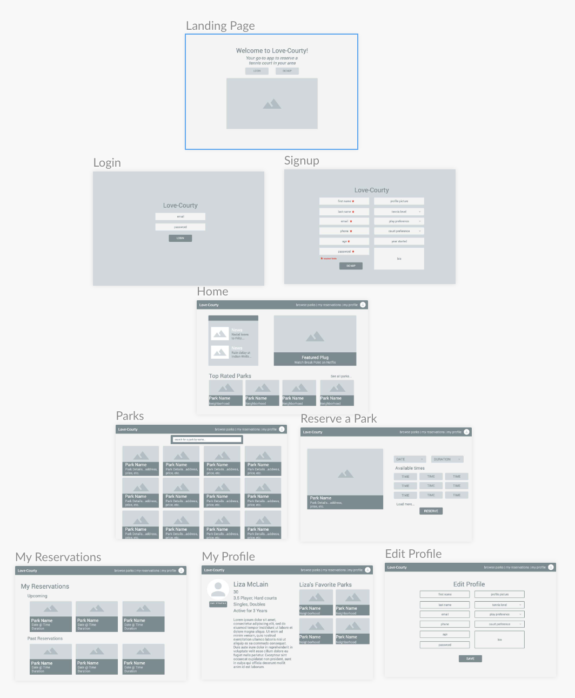

## Backend
### Models
1. A User has many Reservations, has many Ratings; has many Parks through Reservations; has many Courts through Parks
2. A Reservation belongs to a User, belongs to a Park
3. A Park has many Reservations, has many Courts; has many Users through Reservations
4. A Court belongs to a Park
5. A Rating belongs to a User, belongs to a Park
### ERD

### Model Validations
#### Users
* validates **presence** for first_name, last_name, email, phone number, age, and password
* validates **format** for phone number (/\A\+?\d{1,3}[-.\s]?\d{1,10}\z/)
* validates **inclusion** for age (greater than or equal to 18)
* validates **length** for password (minimum: 8)
* validates **uniqueness** for email
* validates **format** for email (VALID_EMAIL_REGEX)
#### Reservations
* validates **presence** for reservation_id, user_id, court_id, date, time, and duration
* validates **numericality** for time and duration
#### Ratings
* validates **presence** for user_id and court_id
* validates **scope** that user can only rate a park once
* validates **numericality** for rating
* validates **inclusion** for rating (between 1 and 5)
  

### Seed Data Example

    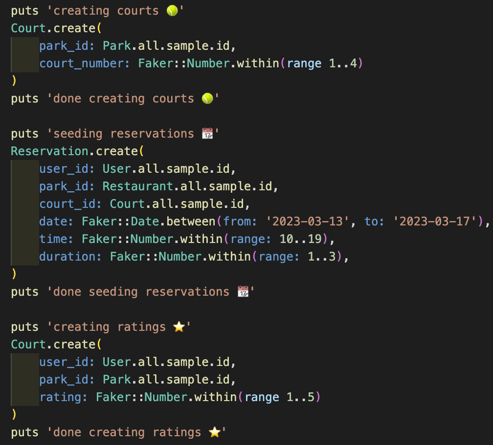

### API Endpoints

  

## Frontend
### React Client-Side Routing

### React Component Tree
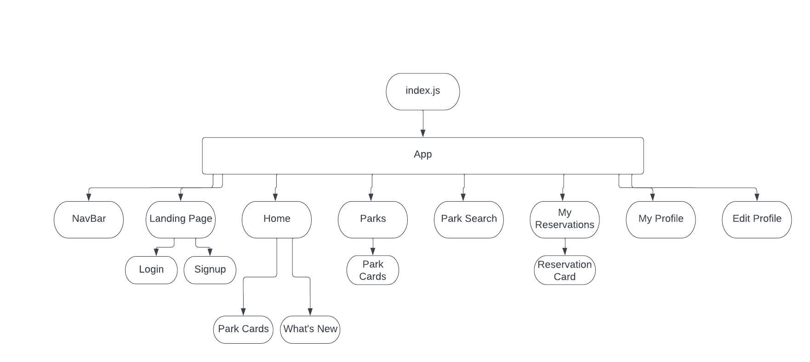

### Detailed Wireframe
Landing Page
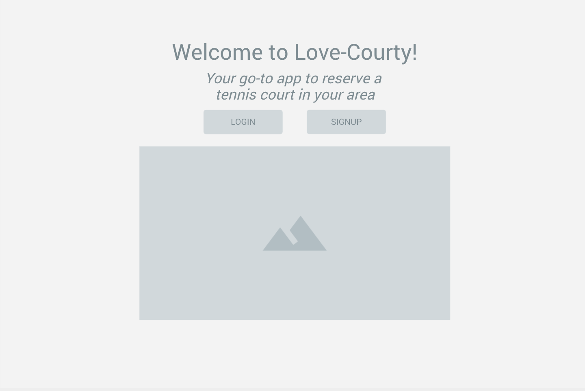
Login
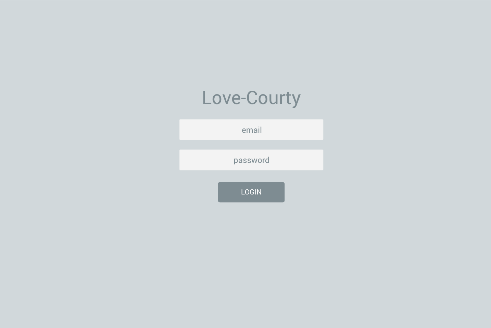
Signup
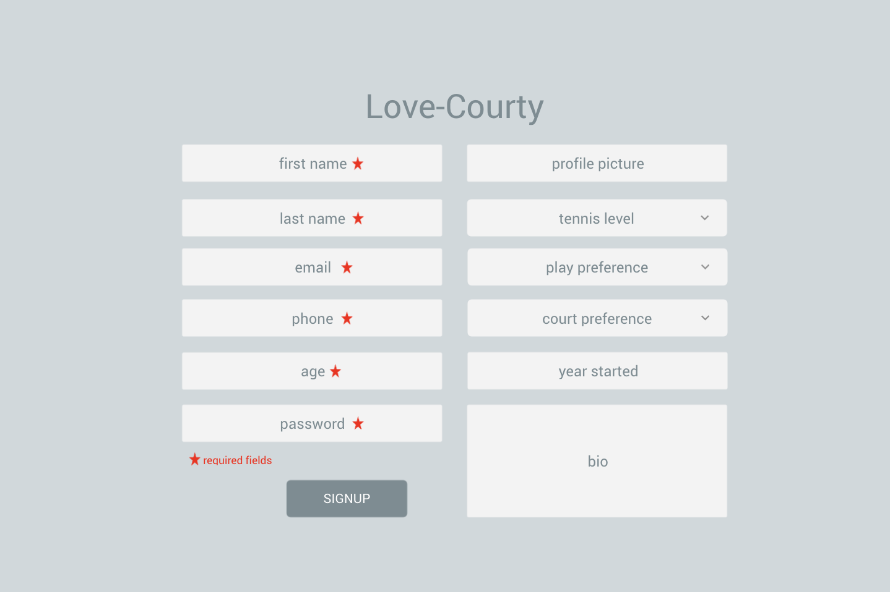
Home

Parks
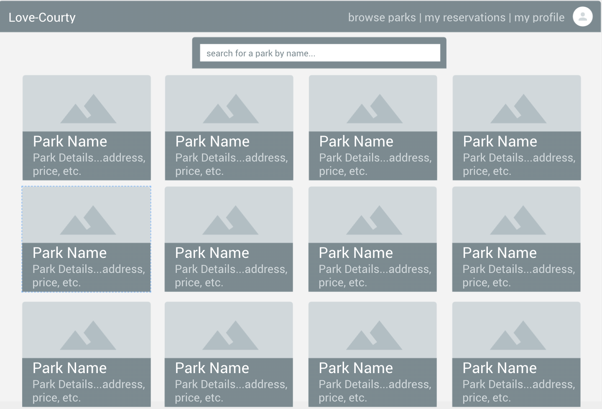
Individual Park
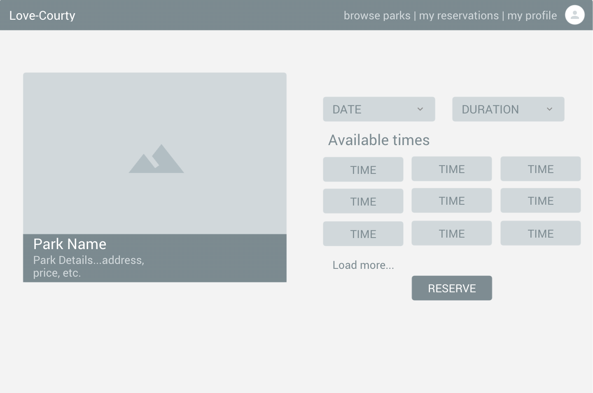
My Reservations

My Profile
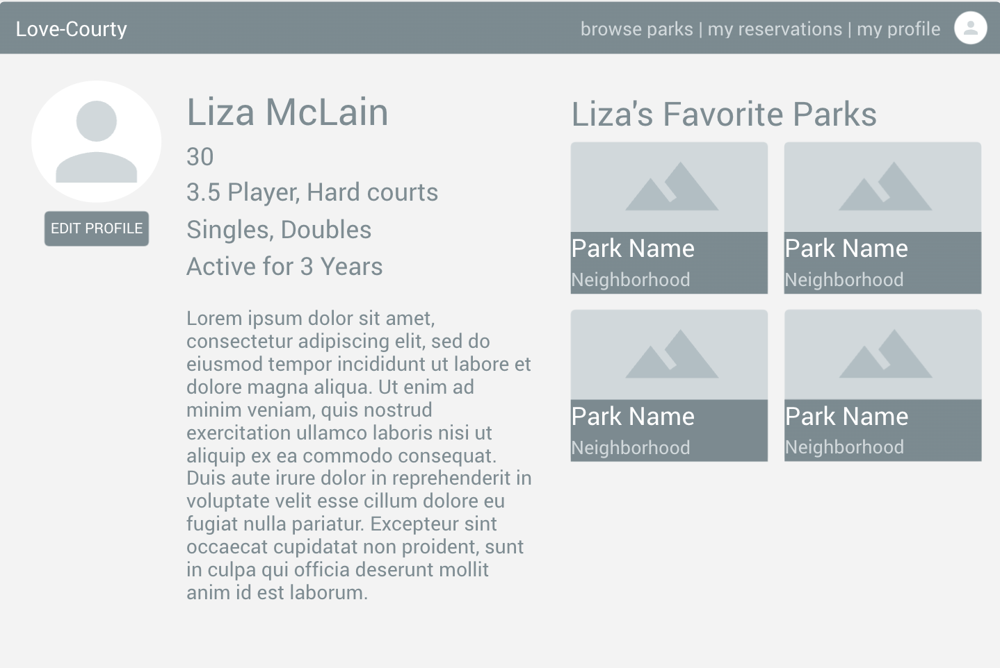
Edit Profile
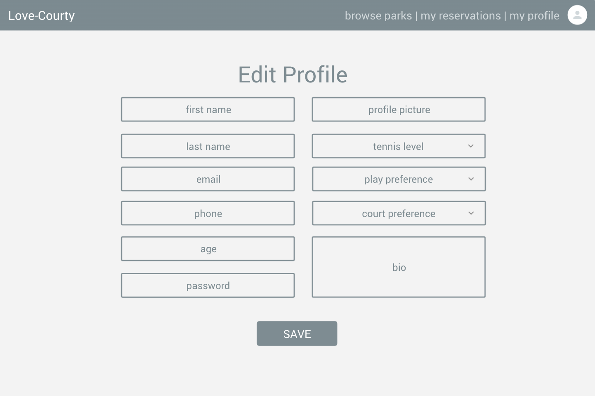

## Stretch Goals
* User can favorite a park
* User can have two types: player and pro
* User can book a lesson with a pro and gain skills through the lesson
* User can have skills
* POST / PATCH / DELETE requests for Reservations use appropriate logic to determine if a court at a park is available for the desired date/time/duration and books/does not book the appropriate court in the reservation
* Password confirmation upon signup and edit profile
* User can change password
* App can send an email
 
ERD with StretchERD with Stretch Goals
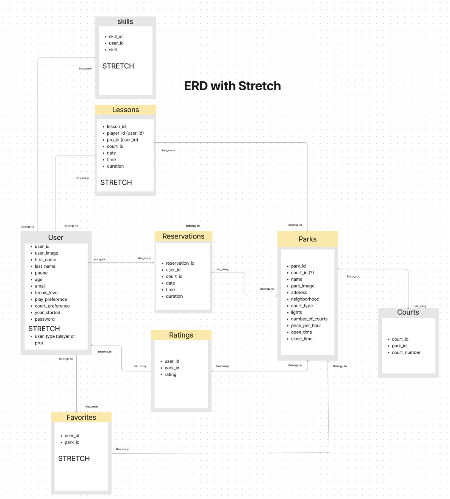
